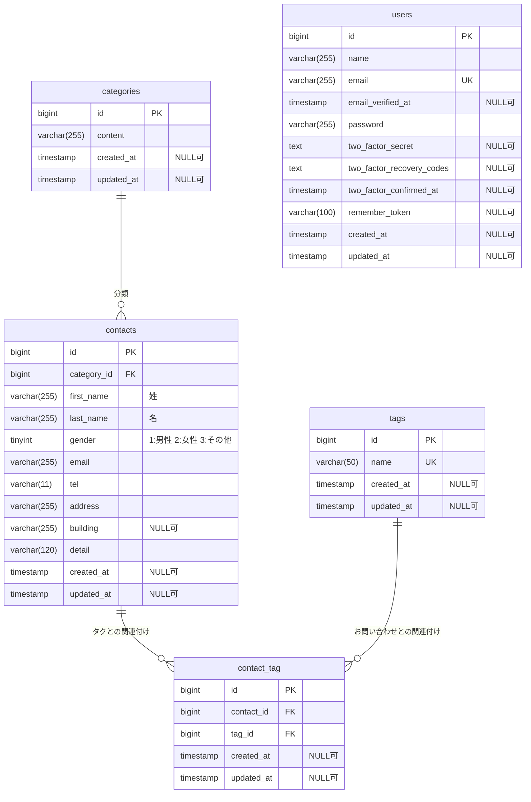

# お問い合わせフォーム

お問い合わせの入力・確認・送信と、管理画面での検索・詳細確認・削除ができるLaravelアプリケーションです。タグ管理、CSV出力、お問い合わせを操作するJSON APIにも対応しています。

## 主な機能

- お問い合わせの入力・確認・登録
- 入力内容のバリデーションと日本語エラーメッセージ
- 会員登録・ログイン・ログアウト
- 管理画面での検索とページネーション（1ページ7件）
- お問い合わせの詳細表示・削除
- タグの追加・編集・削除
- 検索条件を反映したCSV出力
- お問い合わせAPIの一覧取得・詳細取得・登録・更新・削除

## 使用技術

| 項目                 | 技術                               |
| -------------------- | ---------------------------------- |
| 言語                 | PHP 8.2                            |
| フレームワーク       | Laravel 10                         |
| 認証                 | Laravel Fortify                    |
| データベース         | MySQL 8.0                          |
| 開発環境             | Docker Compose / Laravel Sail      |
| 画面                 | Blade / Tailwind CSS 3 / Alpine.js |
| フロントエンドビルド | Vite 5                             |
| テスト               | PHPUnit                            |
| コード整形           | Laravel Pint                       |
| DB管理               | phpMyAdmin                         |

依存パッケージの詳細なバージョンは、composer.lockとpackage-lock.jsonで管理しています。

## 環境構築

### 前提条件

- Gitが使用できること
- DockerとDocker Composeが使用できること
- Windowsの場合は、Docker DesktopのWSL連携を有効にし、WSL2のUbuntuでコマンドを実行すること
- Docker Desktopを起動しておくこと

以下の手順は、新しく取得したプロジェクトの初回構築用です。

### 1. リポジトリの取得

```bash
git clone https://github.com/kegyeng/contact-form-app.git
cd contact-form-app
```

### 2. 環境変数の設定

```bash
cp .env.example .env
```

.envのDB設定は次の値を使用します。

```dotenv
APP_URL=http://localhost
DB_CONNECTION=mysql
DB_HOST=mysql
DB_PORT=3306
DB_DATABASE=laravel
DB_USERNAME=sail
DB_PASSWORD=password
```

これらはローカル開発用の設定です。

### 3. PHP依存パッケージの導入

初回はvendorディレクトリがないため、Docker経由でComposerを実行します。

```bash
docker run --rm \
    -u "$(id -u):$(id -g)" \
    -v "$(pwd):/var/www/html" \
    -w /var/www/html \
    laravelsail/php82-composer:latest \
    composer install --ignore-platform-reqs
```

### 4. コンテナの起動

```bash
./vendor/bin/sail up -d
```

MySQLの起動状態を確認します。

```bash
./vendor/bin/sail ps
```

MySQLがhealthyになってから、次へ進みます。

### 5. アプリケーションキー・DB・初期データの作成

```bash
./vendor/bin/sail artisan key:generate
./vendor/bin/sail artisan migrate --seed
```

初期データとして、ログイン用ユーザー、カテゴリー、タグ、お問い合わせのダミーデータを作成します。

ContactSeederは実行するたびにお問い合わせを追加するため、初期データ作成コマンドの繰り返し実行には注意してください。

### 6. フロントエンドの準備

```bash
./vendor/bin/sail npm ci
./vendor/bin/sail npm run build
```

画面を継続的に編集するときは、ビルドの代わりに開発サーバーを起動できます。

```bash
./vendor/bin/sail npm run dev
```

開発サーバーを起動したターミナルはそのままにし、ほかのコマンドは別のターミナルで実行してください。

## アクセス先

標準のポート設定を使用した場合のURLです。

| 画面・機能           | URL                              |
| -------------------- | -------------------------------- |
| お問い合わせフォーム | http://localhost/                |
| 会員登録             | http://localhost/register        |
| ログイン             | http://localhost/login           |
| 管理画面             | http://localhost/admin           |
| お問い合わせAPI      | http://localhost/api/v1/contacts |
| phpMyAdmin           | http://localhost:8080            |

管理画面とCSV出力にはログインが必要です。

## 動作確認用アカウント

UserSeederで作成されるローカル開発用アカウントです。

| 項目           | 値               |
| -------------- | ---------------- |
| メールアドレス | test@example.com |
| パスワード     | password         |

## お問い合わせAPI

課題仕様に従い、以下のAPIには認証を設けていません。

| メソッド | URL                        | 内容     | 成功時 |
| -------- | -------------------------- | -------- | ------ |
| GET      | /api/v1/contacts           | 一覧取得 | 200    |
| GET      | /api/v1/contacts/{contact} | 詳細取得 | 200    |
| POST     | /api/v1/contacts           | 新規登録 | 201    |
| PUT      | /api/v1/contacts/{contact} | 更新     | 200    |
| DELETE   | /api/v1/contacts/{contact} | 削除     | 204    |

`{contact}`にはお問い合わせIDを指定します。

### 一覧の検索条件

| パラメーター | 内容                                            |
| ------------ | ----------------------------------------------- |
| keyword      | 姓・名・メールアドレスの部分一致検索            |
| gender       | 1：男性、2：女性、3：その他。省略すると全件対象 |
| category_id  | 存在するカテゴリーのID                          |
| date         | 作成日。例：2026-09-12                          |
| page         | ページ番号。1以上、既定値1                      |
| per_page     | 1ページの件数。1〜100、既定値20                 |

例：

```text
http://localhost/api/v1/contacts?gender=1&per_page=2
```

一覧は新しい順で返し、dataにデータ、metaにページ情報を含みます。

### 登録・更新の入力項目

JSONを送信する場合は、Content-TypeとAcceptにapplication/jsonを指定します。

| 項目        | 条件                                         |
| ----------- | -------------------------------------------- |
| first_name  | 姓。必須、255文字以内                        |
| last_name   | 名。必須、255文字以内                        |
| gender      | 必須、整数1・2・3                            |
| email       | 必須、メール形式、255文字以内                |
| tel         | 必須、ハイフンなしの半角数字10〜11桁の文字列 |
| address     | 必須、255文字以内                            |
| building    | 任意、255文字以内                            |
| category_id | 必須、存在するカテゴリーID                   |
| detail      | 必須、120文字以内                            |
| tag_ids     | 任意、存在するタグIDの配列                   |

登録・更新のレスポンスには、カテゴリーとタグも含みます。

更新には必須項目をすべて送信します。更新時にtag_idsを省略するか空配列にすると、既存のタグの関連付けをすべて解除します。

入力エラーは422で返し、errorsに項目別のメッセージを含めます。

存在しないお問い合わせIDへのアクセスは404で返します。

```json
{
    "error": "お問い合わせが見つかりませんでした。"
}
```

削除成功時のレスポンス本文は空です。

## CSV出力

ログイン後、管理画面の「エクスポート」からダウンロードできます。

- URL：GET /contacts/export
- 管理画面の検索条件を反映
- ページ分割せず、検索に一致する全件を出力
- UTF-8 BOM付き
- 新しい順
- 列：ID、氏名、性別、メール、電話、住所、建物、カテゴリ、内容、作成日時

## テスト

テストには、通常のlaravelデータベースとは別のtestingデータベースを使用します。新規MySQLボリュームの初回起動時に、Sailの初期化スクリプトで作成されます。

設定キャッシュを解除し、接続先を確認します。

```bash
./vendor/bin/sail artisan config:clear
./vendor/bin/sail artisan test --filter=DatabaseConnectionTest
```

接続確認が成功したら、全体テストを実行します。

```bash
./vendor/bin/sail artisan test
```

カバレッジを測定する場合：

```bash
./vendor/bin/sail artisan test --coverage
```

測定用ドライバーが利用できない場合は、.envに次を設定します。

```dotenv
SAIL_XDEBUG_MODE=coverage
```

コンテナへ設定を反映してから、再実行します。

```bash
./vendor/bin/sail up -d
./vendor/bin/sail artisan test --coverage
```

2026年9月13日時点の確認結果：

- 125 tests passed
- 609 assertions
- カバレッジ89.1％

## コード整形

整形を実行：

```bash
./vendor/bin/sail bin pint
```

整形状態の確認のみ：

```bash
./vendor/bin/sail bin pint --test
```

## 開発環境の停止・再開

停止：

```bash
./vendor/bin/sail stop
```

再開：

```bash
./vendor/bin/sail up -d
```

## ER図

アプリケーションの主要5テーブルを示します。Laravelの内部管理用テーブルは省略しています。



- PK：主キー、FK：外部キー、UK：一意制約。
- idおよび外部キーのbigint列は符号なしです。
- カテゴリー1件に対し、お問い合わせは0件以上存在します。
- お問い合わせとタグは、contact_tagを介した多対多の関係です。
- contact_tagのcontact_idとtag_idの組み合わせには、一意制約があります。
- お問い合わせやタグを削除すると、対応するcontact_tagの行も削除されます。
- カテゴリーを削除すると、所属するお問い合わせも削除されるDB定義です。
- usersは認証用で、contactsとの直接の外部キー関係はありません。
- 二要素認証用の列は存在しますが、現在のFortify設定では二要素認証機能を有効にしていません。

## 作者

猪俣 拡

GitHub：kegyeng
